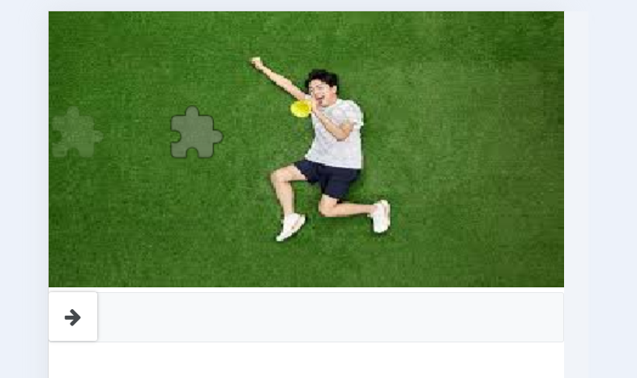

# SpringBoot + 原生JS自实现滑块验证码

## 功能描述：

从服务端静态文件夹随机读取一张本地图片，然后随机生成坐标(x, y)，并将坐标x保存在session会话中，在坐标(x, y)处抠出滑块形状，设置透明度阴影更明显（可调），然后将生成的背景图片和滑块图片传递给前端，前端渲染这两张图片构成滑块验证码，监听拖拉事件，将拖拉停止处的 x坐标 传递给服务端进行校验，若差值在一定范围内则验证通过。

## 优点：

坐标(x, y)为服务端生成，不会传递给前端，因此前端无法窃取到 x坐标 的值，只能通过认为拉取滑块，有效防止了机器盗刷接口（比如短信、登录等）

加以鼠标拖动过程中y轴轨迹、以及拖动时间辅助验证

因本人使用原因，此滑块验证码会读取屏幕宽度，整体宽度 = 屏幕宽度

## 效果图：




## 运行方式：

```
git clone https://github.com/spongehah/slider-captcha.git
```

打开SpringBoot项目，可直接运行，访问方式：http://localhost:8080

## 自定义：

在index.html文件中：

```html
<script>
    var captcha = sliderCaptcha({
        id: 'captcha',
        width: 280,	//画布宽度（因为整体宽度 = 屏幕宽度，所以此参数废弃）
        height: 155,	//画布高度（因为整体宽度 = 屏幕宽度，所以此参数废弃）
        offset: 5,		//容错偏差：（废弃）
        loadingText: '正在加载中...',
        failedText: '再试一次',
        barText: '向右滑动填充拼图',
        repeatIcon: 'fa fa-redo',
        remoteUrl: 'http://localhost:8080',		//服务端访问路径前缀
        onSuccess: function () {  //滑块验证码验证成功调用（可替换）
            var handler = setTimeout(function () {
                window.clearTimeout(handler);
            }, 500);
        },
        onFail: function () {  //滑块验证码验证失败调用（可替换）
            var handler = setTimeout(function () {
                window.clearTimeout(handler);
            }, 500);
        },
        verify: function (startTime, endTime, left, trail, url) {//向服务端发送参数进行校验
            var result = false;
            $.ajax({
                url: url + "/verifyCode",	//url为上面弄自定义的remoteUrl，拼接上服务端验证接口的uri
                data: {
                    startTime: startTime,
                    endTime: endTime,
                    left: left,
                    trail: trail
                },
                async: false,
                cache: false,
                type: 'POST',
                contentType: 'application/x-www-form-urlencoded',
                dataType: 'json',
                success: function (response) {
                    result = response;
                },
                error: function (error) {
                    console.log(error);
                }
            });
            return result;
        }
    });
</script>
</body>
```

在longbow.slidercaptcha.js文件中：

第94 ~ 114 行：

```js
_proto.initSliderCaptcha = function () {
    var that = this;
    var data;
    $.ajax({
        url: this.options.remoteUrl + '/getSliderCaptcha',	//拼接上服务端获取两张图片的接口uri
        type: 'GET',
        async: false,
        cache: false,
        data: {
            width: Math.floor(that.options.width),
            height: Math.floor(that.options.height)
        },
        success: function (res) {
            data = res;
        },
        error: function () {
            console.error('Failed to fetch slider captcha data');
        }
    });
    that.init(data);
};
```